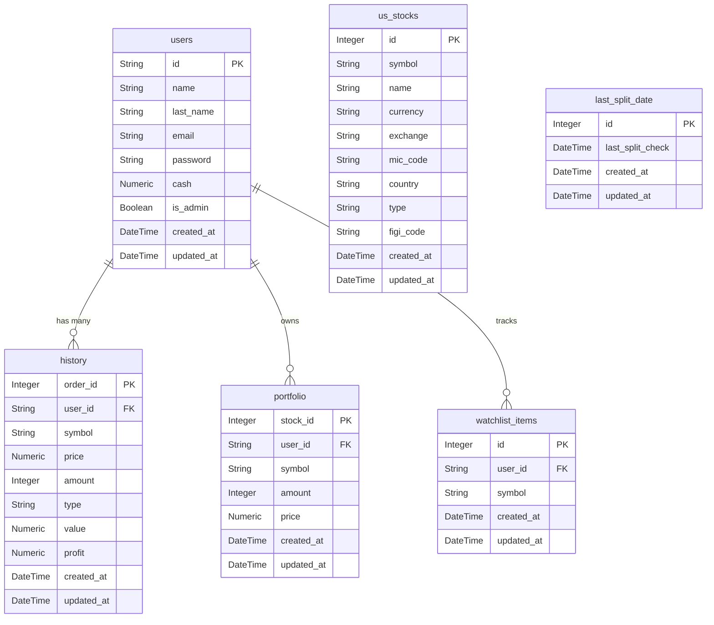

Deploy in the cloud: gunicorn src.exchange.main:app -w <num of cores * 2 + 1> -k uvicorn.workers.UvicornWorker --bind 0.0.0.0:8000

```mermaid
erDiagram
    users ||--o{ history : "has many"
    users ||--o{ portfolio : "owns"
    users ||--o{ watchlist_items : "tracks"

    users {
        String id PK
        String name
        String last_name
        String email
        String password
        Numeric cash
        Boolean is_admin
        DateTime created_at
        DateTime updated_at
    }
    history {
        Integer order_id PK
        String user_id FK
        String symbol
        Numeric price
        Integer amount
        String type
        Numeric value
        Numeric profit
        DateTime created_at
        DateTime updated_at
    }
    portfolio {
        Integer stock_id PK
        String user_id FK
        String symbol
        Integer amount
        Numeric price
        DateTime created_at
        DateTime updated_at
    }
    watchlist_items {
        Integer id PK
        String user_id FK
        String symbol
        DateTime created_at
        DateTime updated_at
    }
    us_stocks {
        Integer id PK
        String symbol
        String name
        String currency
        String exchange
        String mic_code
        String country
        String type
        String figi_code
        DateTime created_at
        DateTime updated_at
    }
    last_split_date {
        Integer id PK
        DateTime last_split_check
        DateTime created_at
        DateTime updated_at
    }
```